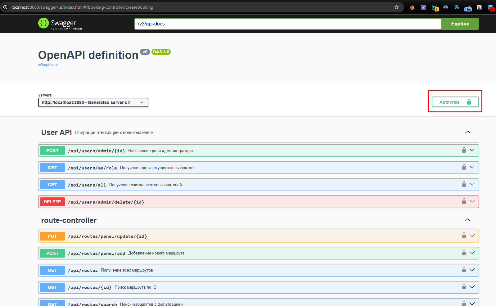
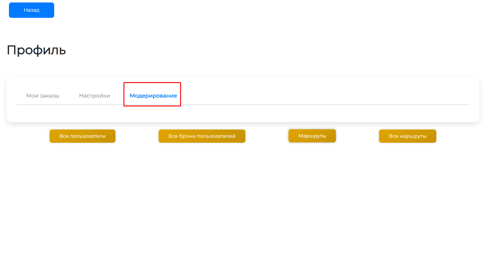
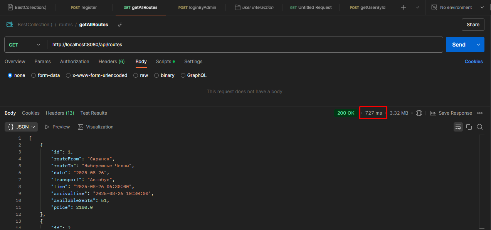
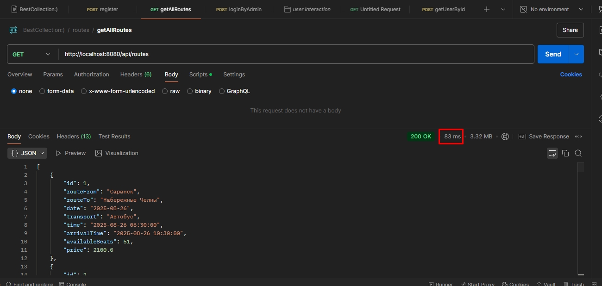
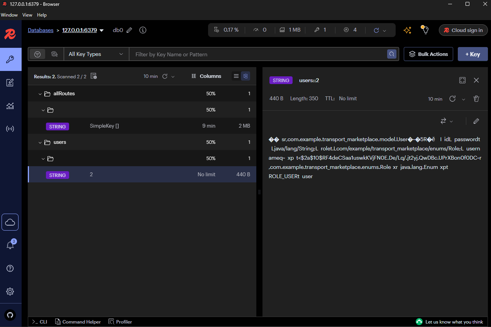
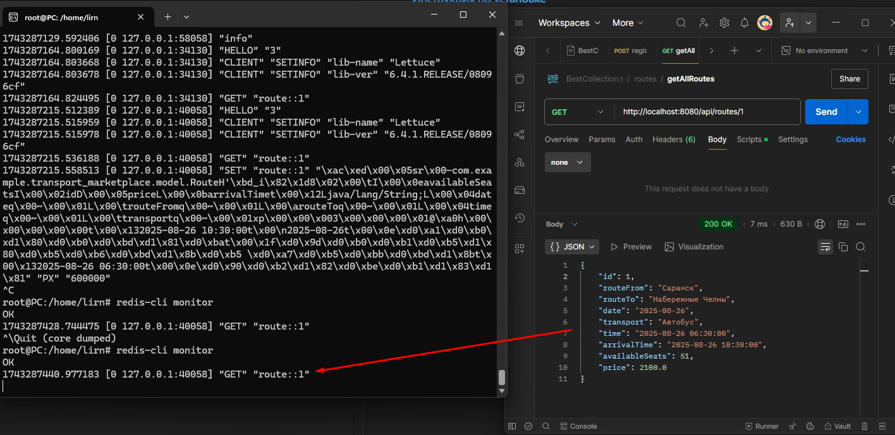

# ПАНЕЛЬ НАВИГАЦИИ
- [🚀 Быстрый старт](#быстрый-старт)
- [🌟 Особенности](#особенности)
- [📚 Документация API](#документация-api-)
- [🔧 Решение проблем](#решение-проблем-)
- [👥 Начальные пользователи](#начальные-пользователи-)
- [🛠 Установка компонентов через cmd](#-установка-компонентов)
- [🔥 Новые фичи](#новые-фичи)
  - [Redis](#redis)

# Инструкция по установке и настройке Maven и Java ручками без командной строки

## 1. Установка Apache Maven

1. Скачайте Maven с [официального сайта](https://maven.apache.org/download.cgi) (версия 3.9.9).
2. Распакуйте архив в выбранную папку, например:  
   `C:\Program Files\apache-maven-3.9.9`.
3. Добавьте путь к Maven в переменные среды:
   - Откройте **Параметры системы** → **Переменные среды**.
   - В разделе **Системные переменные** выберите `Path` → **Изменить** → **Создать**.
   - Вставьте путь к папке `bin` Maven:  
     `C:\Program Files\apache-maven-3.9.9\bin`.
   - Нажмите **ОК** во всех окнах.

## 2. Настройка переменной JAVA_HOME

1. Убедитесь, что установлен **JDK 21** (скачайте с [официального сайта](https://www.oracle.com/java/technologies/downloads/)).
2. Проверьте путь к JDK, например:  
   `C:\Program Files\Java\jdk-21`.
3. Настройте переменную `JAVA_HOME`:
   - В разделе **Системные переменные** нажмите **Создать**.
   - Введите:
     - **Имя переменной**: `JAVA_HOME`
     - **Значение переменной**: `C:\Program Files\Java\jdk-21`
   - Нажмите **ОК**.
4. Обновите `Path`:
   - Выберите `Path` → **Изменить** → **Создать**.
   - Добавьте: `%JAVA_HOME%\bin`.
## 3. Node
1. Скачать и установить с официального сайта - [официальный сайт](https://nodejs.org/en)
2. Проверьте установку:
```bash
mvn -version
java -version
node -v
```

# В клиенте
Открыть саму директорию, после установить сами зависимости
```bash
npm install
npm run serve
```
Подробнее как запустить - [тут](#быстрый-старт)
## 🛠 Установка компонентов

### Необходимые инструменты:
| Инструмент             | Ссылка для скачивания                     | Минимальная версия |
|------------------------|-------------------------------------------|--------------------|
| Apache Maven           | [Скачать](https://maven.apache.org)       | 3.9.9              |
| Java Development Kit   | [Скачать](https://www.oracle.com/java)    | 21                 |
| Node.js                | [Скачать](https://nodejs.org)             | 18.x               |
| Docker                 | [Скачать](https://www.docker.com)         | 20.10+             |

### Настройка окружения:
1. Установите переменные среды:
   ```bash
   # Windows
   setx JAVA_HOME "C:\Program Files\Java\jdk-21"
   setx PATH "%PATH%;%JAVA_HOME%\bin;C:\Program Files\apache-maven-3.9.9\bin"

   # Linux/MacOS
   export JAVA_HOME=/usr/lib/jvm/jdk-21
   export PATH=$PATH:$JAVA_HOME/bin:/opt/apache-maven-3.9.9/bin


# Transport Marketplace 🚚

Полнофункциональное приложение для управления транспортными услугами на основе Spring Boot и Vue.js с использованием Docker.

---

## Особенности
- Аутентификация через JWT
- Ролевая модель доступа (Админ/Пользователь)
- H2 Database с файловым хранилищем
- Документация API через Swagger
- Docker-контейнеризация

---

## Требования
- Docker 20.10+
- Docker Compose 2.20+
- JDK 21
- Maven 3.9.9

# Быстрый старт

## Установка через Docker🐳
- Клонируйте репозеторий:
```
git clone https://github.com/ваш-логин/transport-marketplace.git
cd transport-marketplace
```
- Запустите проект:
```
# Быстрый запуск через докер
docker-compose up --build

```
- Сервисы будут доступны:
  - Фронтенд: http://localhost
  - Бэкенд: http://localhost:8080
  - Swagger: http://localhost:8080/swagger-ui.html
  - H2 Console: http://localhost:8080/h2-console
### Основные команды:
| Команда                          | Описание                                 |
|----------------------------------|------------------------------------------|
| `docker-compose down -v`         | Полная остановка с удалением данных      |
| `docker-compose logs -f backend` | Просмотр логов бэкенда                    |


### Ручной запуск
```
# Для ручного запуска
# 1. Надо сначала будет запустить бэк ./transportApp
mvn clean package
mvn spring-boot:run
# 2. Потом запускать фронт ./transportApp/client
npm install
npm run serve
```

# Документация API 📚
Доступна через Swagger UI:
```
http://localhost:8080/swagger-ui.html
```
### Чтобы можно было непосредственно взаимодействовать с API, как user:

1. Зарегистрируйтесь в **Аутентификии** или обратитесь к [Предустановленным пользователям](#начальные-пользователи-)
2. После выдачи ключа(access token) в sign-in вставьте его сюда:

 

### Авторизация:
- Используйте логины:
    - Админ: admin/secure_admin
    - Пользователь: user/user_password

### Манипуляции, как админ на клиенте
После входа, как админ вам будет открыта вкладка **Модерирование** в профиле


# Решение проблем 🚨
Сборка Docker завершается с ошибкой:
## Частые ошибки:
1. Сборка Docker завершается с ошибкой:
    ```
    docker system prune -a  # Очистка кэша
    rm -rf client/node_modules client/package-lock.json
    ```
2. Проблемы с H2 Database:
 - Проверьте настройки подключения в H2 Console:
     ```
    JDBC URL: jdbc:h2:file:/app/data/transport_db
    User: root
    Password: root
    ```
# Начальные пользователи 👥
## Автоматически создаются при первом запуске:
 | Логин   | Пароль          |
 |---------|-----------------|
 | `admin` | `secure_admin`  |
 | `user`  | `user_password` |

# Новые фичи🔥
- Cookie
- Кеширование
- Rate limit

## Redis💾
### 1. Теперь все частые запросы кешируются 

### До
 
### После
 

## Все можно отследить
- Можно через Redis Insight

 
-  На Linux/WSL
### [Инструкция по установке](https://redis.io/docs/latest/operate/oss_and_stack/install/install-redis/install-redis-on-linux/)
Для того, чтобы мониторить все итерации в редисе, пропишите в консоль
```
redis-cli monitor
```


